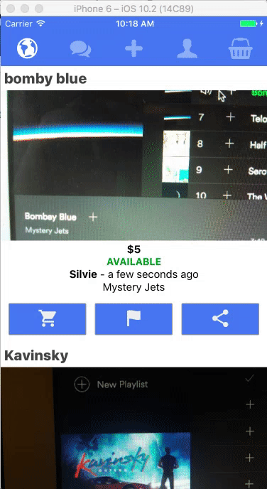
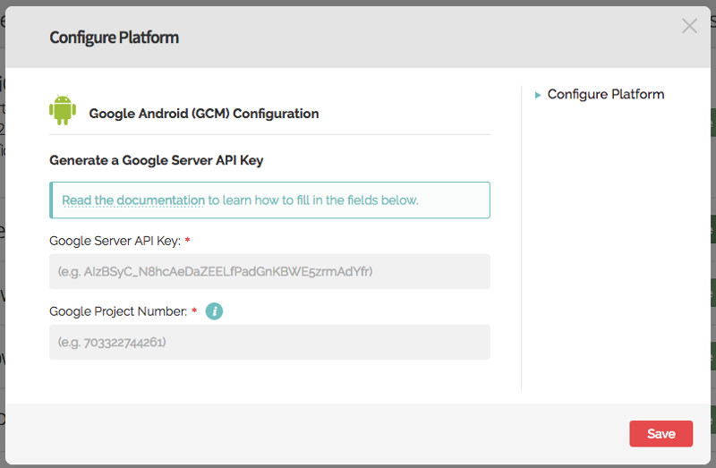

# The ultimate React Native starter using Firebase, Mobx, Code-Push and OneSignal

## Download from the app stores
[![iOS app][2]][1] [![Android app][4]][3]

  [1]: https://itunes.apple.com/us/app/jsapp-my-app/id1165501349?mt=8
  [2]: ./graphics/app-store-badge.png
  [3]: https://play.google.com/store/apps/details?id=me.jsapp.myapp
  [4]: ./graphics/google-play-badge.png  

#### Build your own Instagram + WhatsApp + chat marketplace mobile app clone

## Built with
 - [React Native](https://facebook.github.io/react-native/) : One language, JavaScript, one source code.
 - [MobX](https://mobxjs.github.io/mobx/) : Simple, scalable state management (easier than Redux)
 - [Firebase](https://firebase.google.com/) : Cloud based database and storage service
 - [CodePush](https://microsoft.github.io/code-push/) : Push code updates to your apps, instantly
 - [OneSignal](https://onesignal.com/) : Unlimited push notifications‎

I really appreciate any suggestions, feedback, PRs and issues.

## How to install this app?
### Prerequisites
To create your own copy of this application, here are the prerequisites:

 - [Yarn](https://yarnpkg.com/) installed on your system or simply use npm if you prefer.
 - [React Native](https://facebook.github.io/react-native/) installed on your system.
 - [Android SDK](https://developer.android.com/studio/index.html) installed to run the app on an android device.
 - [Xcode](https://developer.apple.com/xcode/) installed to test the app on an iOS devices or simulator.

### Build your own copy
First clone the repository using:

    git clone https://github.com/jsappme/react-native-firebase-starter.git
    cd react-native-firebase-starter

### Firebase Setup:

After Login or Register at https://firebase.google.com/

Go to your Firebase console: https://console.firebase.google.com/

- First create a new project and click on Add Firebase to your web app.

- Copy and Paste your Firebase variables into:

    atom src/firebase.js

- Next setup the Firebase Auth by enabling Email/Password Signup method:
https://console.firebase.google.com/project/myapp/authentication/providers

- Copy and Paste your Firebase rules at:
https://console.firebase.google.com/project/myapp/database/rules

    {
      "rules": {
        ".read": "auth != null",
        ".write": "auth != null",
        "usernameList" : {
          ".read": true
        },
        "posts": {
            ".indexOn": "createdAt",
            ".read": true
        },
        "user_posts": {
          "$uid": {
            "posts": {
              ".indexOn": "createdAt"
            },
          },
        },
        "user_orders": {
          "$uid": {
            "posts": {
              ".indexOn": "createdAt"
            },
          },
        },
        "user_chats": {
          "$uid": {
            "posts": {
              ".indexOn": "updatedAt"
            },
          },
        },
      }
    }

That's it for Firebase. Now let's setup the push notifications.

### OneSignal Setup

With the help from this great article by Spencer Carli:
https://medium.com/differential/react-native-push-notifications-with-onesignal-9db6a7d75e1e#.dwpff7u2z

- Login or Register at https://onesignal.com

- Add new app and select the Android platform first

- Open a new tab and go to your Firebase app Settings > CLOUD MESSAGING: https://console.firebase.google.com/project/myapp-1dbb8/settings/cloudmessaging

https://documentation.onesignal.com/docs/generate-a-google-server-api-key

- and Save the two values listed:
* Server key, also known as the Google Server API key.
* Sender ID, also known as the Google Project Number *a.k.a my_onesignal_google_project_number you will need it later*

- Paste those two values on the OneSignal > Google Android (GCM) Configuration and Save it

- Let's configure the iOS platform by clicking on Configure next to Apple iOS in MyApp > App Settings

- Open a new tab and create our app within the [Apple Developer portal](https://developer.apple.com/account/ios/identifier/bundle)

- Set an Explicit App ID, the same you define as PRODUCT_BUNDLE_IDENTIFIER (set twice) in:

      atom ios/MyApp.xcodeproj/project.pbxproj

- Enable push notifications for this app

- Now let's create the provisioning profile. OneSignal has a tool called [The Provisionator](https://onesignal.com/provisionator) that will help with this process.

- Sign into your account and make sure you choose the proper team

- After pressing Next, you’ll see something like this

- Download those files and remember the password for the p12 file. Then head back to OneSignal, upload our file, enter your password and Save

Your Push Notifcation platforms are now set up. Now we can actually work on integrating this with our app.

- Go to MyApp > App Settings > Keys & IDs and copy the two values:

* OneSignal App ID *a.k.a. my_onesignal_app_id*
* REST API Key *a.k.a. my_onesignal_api_key*

- Edit, Find and Replace the following values:

* my_onesignal_google_project_number in:
$ atom android/app/build.gradle

* my_onesignal_app_id in:
$ atom android/app/build.gradle
$ atom src/store/AppStore.js
$ atom ios/MyApp/AppDelegate.m

* my_onesignal_api_key in:
$ atom src/store/AppStore.js

Then install the dependencies using:

    yarn

To link the react-native-vector-icons package to react native:

    react-native link

Then run the following command to run the app on the emulator.

    react-native run-android

or if you have Xcode installed:

    react-native run-ios

To see the logs:

    react-native log-android

or

    react-native log-ios

##Firebase Setup

Create a new app at:
https://console.firebase.google.com/

Enable the Email/Password provider for your sign-in method at:
https://console.firebase.google.com/project/YOURPROJECT/authentication/providers

Copy your Firebase variables by clicking on Add Firebase to your web app at:
https://console.firebase.google.com/project/YOURPROJECT/settings/general/

Edit and publish your rules and indexOn at:
https://console.firebase.google.com/project/YOURPROJECT/database/rules

with:

    {
      "rules": {
        ".read": "auth != null",
        ".write": "auth != null",
        "usernameList" : {
          ".read": true
        },
        "posts": {
            ".indexOn": "createdAt",
            ".read": true
        },
        "user_posts": {
          "$uid": {
            "posts": {
              ".indexOn": "createdAt"
            },
          },
        },
        "user_orders": {
          "$uid": {
            "posts": {
              ".indexOn": "createdAt"
            },
          },
        },
        "user_chats": {
          "$uid": {
            "posts": {
              ".indexOn": "updatedAt"
            },
          },
        },
      }
    }

and edit the firebase configuration file with your own settings:

    atom src/firebase.js

Now, you have your own copy of this application!

##License
[MIT License](https://github.com/jsappme/react-native-firestack-starter/blob/master/LICENSE). Do whatever you want to do.

## Credits
All the credits goes to all library creators and contributors to the open source repositories and libraries that I am using. I'm very grateful to all of them.

 - [React Native Fetch Blob](https://github.com/wkh237/react-native-fetch-blob)
 - [React Native Keyboard Aware Scroll View](https://github.com/APSL/react-native-keyboard-aware-scroll-view)
 - [React Native Image Picker](https://github.com/marcshilling/react-native-image-picker)
 - [React Native Cacheable Image](https://github.com/jayesbe/react-native-cacheable-image)
 - [Mister Poster](https://github.com/shoumma/Mister-Poster)
 - [React Native](https://facebook.github.io/react-native/)
 - [React Native Animatable](https://github.com/oblador/react-native-animatable)
 - [React Native Scrollable Tab View](https://github.com/skv-headless/react-native-scrollable-tab-view)
 - [React Native Vector Icons](https://github.com/oblador/react-native-vector-icons)
 - [MobX](https://github.com/mobxjs/mobx)
 - [MobX React](https://github.com/mobxjs/mobx-react)
 - [React Native MobX](https://github.com/aksonov/react-native-mobx)
 - [Firebase](https://firebase.google.com/)
 - [Moment JS](http://momentjs.com/)
 - [Lodash](https://lodash.com/)

Made with ♥ by [JSapp.me](http://jsapp.me)
